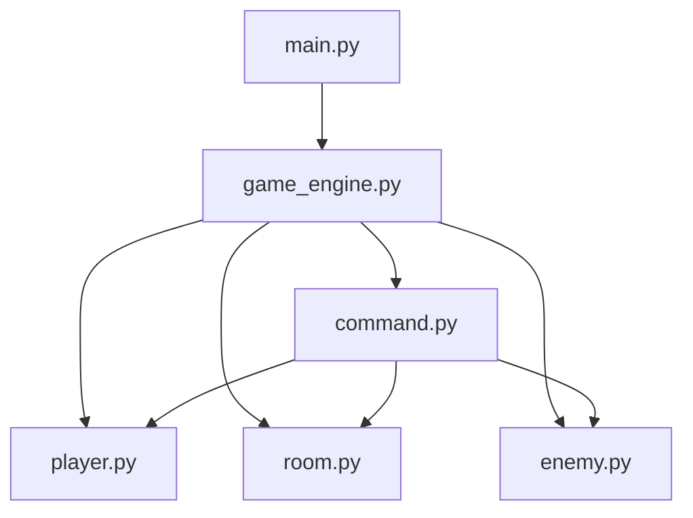

# Soft Engineering - 文字 MUD 游戏

软件工程课程项目（团队：4399）

## 项目简介

本项目是一个基于 Python 的文字 MUD（Multi-User Dungeon）原型，实现了：

- 房间探索与移动（north/south/east/west）
- 物品拾取与丢弃
- 敌人战斗与掉落
- 命令驱动的交互式游戏循环

## 系统架构图（模块关系）




架构说明：

- `main.py`：程序入口，启动游戏引擎。
- `game_engine.py`：游戏流程控制、世界初始化、命令分发。
- `command.py`：命令模式实现，封装 `look/move/get/drop/attack/status/help/quit` 等行为。
- `player.py`：玩家状态与行为（生命值、背包、攻击）。
- `room.py`：房间、出口、物品、敌人容器。
- `enemy.py`：敌人属性与战斗行为。

## 核心业务模块职责说明

- `GameEngine`（`game_engine.py`）
  - 初始化游戏世界（房间连接、道具、敌人）
  - 接收并解析玩家输入
  - 路由到对应命令并维护战斗状态
- `Command` 体系（`command.py`）
  - 统一命令接口（`execute/get_name/get_description`）
  - 各具体命令只关注单一行为，降低分支复杂度
- `Player`（`player.py`）
  - 管理玩家生命值、背包、攻击与治疗
- `Room`（`room.py`）
  - 维护房间内容（出口、物品、敌人）与安全区属性
- `Enemy`（`enemy.py`）
  - 管理敌人战斗属性、反击与掉落条件

## 本地开发环境搭建

### 1. 克隆仓库

```bash
git clone <你的仓库地址>
cd Soft-Engineering
```

### 2. 创建并激活虚拟环境

Windows (PowerShell):

```powershell
python -m venv .venv
.\.venv\Scripts\Activate.ps1
```

macOS/Linux:

```bash
python3 -m venv .venv
source .venv/bin/activate
```

### 3. 安装依赖

```bash
python -m pip install --upgrade pip
pip install pytest pytest-cov
```

> 若后续新增 `requirements.txt`，可执行：`pip install -r requirements.txt`

### 4. 运行测试

```bash
pip install -r requirements.txt
pytest tests/ -v
pytest tests/test_api_integration.py -v
```

### 5. 启动 CLI 游戏

```bash
python src/main.py
```

## 迭代 5：Web + API + Docker

### 启动 REST API

```bash
uvicorn backend.app:app --reload --port 8000
```

### 启动 Web 前端（React + Canvas）

```bash
cd frontend
npm install
npm run dev
```

访问 http://localhost:5173

### Docker

```bash
docker compose up --build api
```

详细说明见 `docs/iteration5_web_devops.md`。

## CI 自动化测试说明

项目已配置 GitHub Actions（`.github/workflows/ci.yml`）：

- 单元测试 + REST API 集成测试
- Docker 镜像构建并推送到 GHCR（`ghcr.io/<仓库>/mud-api`）
- 前端 `npm run build` 校验

## 可维护性审计与重构产出

本次迭代已完成：

- 可维护性五因素自评报告：`docs/maintainability_self_assessment.md`
- TDD 回归保护：`tests/` 下新增至少 3 个单元测试并纳入 CI
- 局部重构：抽离命令解析与战斗状态判定逻辑，提升可读性与可修改性

