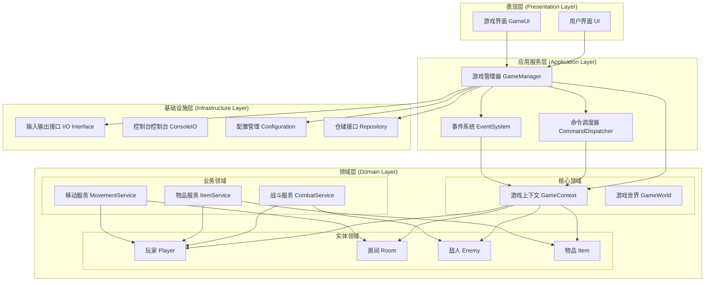

# MUD 游戏架构审查与重构报告

## 团队分工


| 角色                     | 成员              | 职责                  |
| ---------------------- | --------------- | ------------------- |
| **Product Owner (PO)** | 符鹏 (9109223063) | 业务需求分析、产品愿景、优先级管理   |
| **Scrum Master (SM)**  | 张琪 (9109223062) | 团队协调、进度跟踪、质量把控、架构审查 |
| **DevTeam**            | 张琪 (9109223062) | 核心开发、代码实现、重构设计、文档编写 |


## 概述

本报告基于增强后的 MUD 游戏系统，结合 DFD 与 OOA 模型的分析，深入审查了系统当前的架构问题，并提出了具体的解耦重构方案。

## 一、架构审查结果

### 1.1 当前架构特点

#### 优点：

1. **功能完整**：实现了移动、探索、战斗、物品管理等完整功能
2. **代码结构清晰**：主要模块分离，职责相对明确
3. **支持扩展**：可以方便添加新的命令类型
4. **易于理解**：基于命令模式的架构直观易懂

#### 主要问题：

##### 1. God Class 问题（GameEngine）

```python
class GameEngine:
    # 承担过多职责：
    # - 游戏流程控制
    # - 命令管理
    # - 世界创建
    # - 战斗状态管理
    # - 错误处理
    # - 输入输出协调
```

##### 2. 紧耦合问题

- **Command.execute(game_engine)**：整个命令系统依赖 GameEngine 对象
- **硬编码配置**：房间和敌人在代码中硬编码
- **状态管理分散**：战斗状态、游戏状态分散在多个类中

##### 3. 缺乏抽象层

- 没有统一的命令上下文接口
- 输出直接使用 print()，无法测试
- 没有数据持久化抽象

##### 4. 违反的设计原则

###### 单一职责原则 (SRP)

```python
# 违反示例
class GameEngine:
    def main_game_loop(self):     # 游戏流程控制
    def _setup_world(self):       # 世界创建
    def _init_commands(self):     # 命令管理
    def handle_combat(self):      # 战斗逻辑
```

###### 依赖倒置原则 (DIP)

```python
# 违反示例：具体依赖抽象
class MoveCommand:
    def execute(self, game_engine):  # 依赖具体实现
        current_room = game_engine.player.current_room
```

###### 开闭原则 (OCP)

```python
# 违反示例：添加新功能需要修改现有代码
class GameEngine:
    def _init_commands(self):
        self.commands = [
            LookCommand(),     # 硬编码
            MoveCommand(),     # 硬编码
            # 添加新命令需要修改这里
        ]
```

###### 接口隔离原则 (ISP)

```python
# 违反示例：命令接口过于复杂
class Command:
    def execute(self, game_engine) -> bool:
        # 需要知道整个 game_engine 的内部结构
        pass
```

### 1.2 代码质量分析

#### 圈复杂度分析

- **GameEngine.main_game_loop()**: 高复杂度（嵌套条件、异常处理）
- **MoveCommand.execute()**: 中等复杂度（逻辑分支）
- **AttackCommand.execute()**: 高复杂度（战斗逻辑复杂）

#### 代码重复

- 错误处理代码重复
- 状态检查代码重复
- 输出格式化代码重复

#### 测试难度

- 由于紧耦合，难以进行单元测试
- GameEngine 的多个职责混合，难以独立测试

## 二、重构方案

### 2.1 整体架构设计




### 2.2 具体重构步骤

#### 步骤 1：拆分 GameEngine（优先级：高）

```python
# 原始的 GameEngine
class GameEngine:
    def __init__(self):
        self.player = None
        self.current_room = None
        # ... 15个属性

# 重构后
class GameManager:
    """游戏管理器 - 只负责游戏流程控制"""
    def __init__(self):
        self.context = GameContext()
        self.dispatcher = CommandDispatcher()
        self.event_system = EventSystem()

class CommandDispatcher:
    """命令调度器 - 负责命令路由"""
    def __init__(self):
        self.commands = {}
        self.register_commands()

class GameContext:
    """游戏上下文 - 统一的状态管理"""
    def get_player(self) -> Player:
        return self._player

    def get_current_room(self) -> Room:
        return self._current_room
```

#### 步骤 2：引入依赖注入（优先级：高）

```python
# 改造后的 Command
class Command(ABC):
    @abstractmethod
    def execute(self, context: GameContextInterface) -> bool:
        pass

class MoveCommand(Command):
    def execute(self, context: GameContextInterface) -> bool:
        # 只依赖上下文，不依赖整个 GameEngine
        current_room = context.get_current_room()
        # ... 移动逻辑
```

#### 步骤 3：配置化游戏世界（优先级：中）

```json
// world_config.json
{
    "rooms": [
        {
            "id": "start_room",
            "name": "起始房间",
            "description": "一个温馨的小房间",
            "exits": {
                "north": "north_room"
            },
            "items": ["火把"],
            "is_safe": true
        }
    ],
    "enemies": [
        {
            "id": "goblin",
            "name": "哥布林",
            "hp": 50,
            "attack_power": 15,
            "defense": 8,
            "loot": ["金币", "短剑"]
        }
    ]
}
```

#### 步骤 4：实现事件系统（优先级：中）

```python
class EventSystem:
    def __init__(self):
        self.handlers = {}

    def subscribe(self, event_type: str, handler):
        if event_type not in self.handlers:
            self.handlers[event_type] = []
        self.handlers[event_type].append(handler)

    def publish(self, event: Event):
        event_type = event.__class__.__name__
        if event_type in self.handlers:
            for handler in self.handlers[event_type]:
                handler.handle(event)

# 使用示例
class PlayerMovedEvent(Event):
    def __init__(self, player, old_room, new_room):
        self.player = player
        self.old_room = old_room
        self.new_room = new_room
```

#### 步骤 5：抽象化输入输出（优先级：低）

```python
class IOInterface(ABC):
    @abstractmethod
    def read_input(self, prompt: str = "") -> str:
        pass

    @abstractmethod
    def write_output(self, message: str) -> None:
        pass

class ConsoleIO(IOInterface):
    def read_input(self, prompt: str = "") -> str:
        return input(prompt)

    def write_output(self, message: str) -> None:
        print(message)

class MockIO(IOInterface):
    def __init__(self):
        self.inputs = []
        self.outputs = []

    def set_input(self, inputs):
        self.inputs = inputs

    def get_outputs(self):
        return self.outputs
```

### 2.3 面向对象基石的运用

#### 封装 (Encapsulation)

```python
# 重构前
class Player:
    def __init__(self, name):
        self.name = name
        self.hp = 100
        self.inventory = []

# 重构后
class Player:
    def __init__(self, name):
        self._name = name
        self._hp = 100
        self._inventory = []
        self._max_hp = 100

    @property
    def name(self):
        return self._name

    def take_damage(self, damage: int) -> bool:
        self._hp = max(0, self._hp - damage)
        return self._hp == 0

    def heal(self, amount: int):
        self._hp = min(self._hp + amount, self._max_hp)
```

#### 继承 (Inheritance)

```python
# 重构前
class LookCommand(Command):
    def execute(self, game_engine):
        # 具体实现

class MoveCommand(Command):
    def execute(self, game_engine):
        # 具体实现

# 重构后 - 使用组合优于继承
class BaseCommand(Command):
    def __init__(self, context: GameContextInterface):
        self._context = context

    def validate_command(self, args: List[str]) -> bool:
        # 基础验证逻辑
        pass

class LookCommand(BaseCommand):
    def execute(self) -> bool:
        # 具体实现，无需重复验证
        pass
```

#### 多态 (Polymorphism)

```python
# 重构前
def handle_command(command_name, game_engine):
    if command_name == "look":
        # 处理 look
    elif command_name == "move":
        # 处理 move
    # ...

# 重构后
class CommandHandler:
    def handle(self, command: Command) -> bool:
        return command.execute(self.context)

# 使用统一接口
commands = [LookCommand(), MoveCommand()]
for command in commands:
    handler.handle(command)
```

## 三、重构实施计划

### Sprint 2 重点任务（当前 Sprint）

1. **拆分 GameEngine**
  - 创建 GameManager、CommandDispatcher、GameContext
  - 重构现有命令使用 GameContext
  - 实现依赖注入
2. **配置化游戏世界**
  - 创建配置加载器
  - 外化房间、敌人、物品配置

### Sprint 3 任务

1. **实现事件系统**
  - 基础事件发布订阅
  - 战斗事件处理
  - 状态同步事件
2. **抽象化 I/O 层**
  - 实现 ConsoleIO
  - 实现 MockIO 用于测试

### Sprint 4 任务

1. **完善分层架构**
  - 领域服务实现
  - 仓储模式引入
  - 性能优化

### 重构收益


| 方面        | 重构前          | 重构后     |
| --------- | ------------ | ------- |
| **代码复杂度** | 高（God Class） | 低（单一职责） |
| **测试难度**  | 难（紧耦合）       | 易（依赖注入） |
| **扩展性**   | 差（硬编码）       | 好（配置驱动） |
| **维护成本**  | 高（全局修改）      | 低（局部修改） |
| **功能扩展**  | 慢（多处修改）      | 快（添加组件） |


## 四、风险与对策

### 1. 重构风险

#### 风险 1：功能回归

- **描述**：重构过程中可能破坏现有功能
- **对策**：编写自动化测试，逐步重构

#### 风险 2：学习成本

- **描述**：团队成员需要学习新的架构模式
- **对策**：提供文档和培训，结对编程

#### 风险 3：进度延误

- **描述**：重构可能影响开发进度
- **对策**：并行开发，小步快跑

### 2. 质量保证措施

1. **代码审查**：每个重构提交都要进行代码审查
2. **自动化测试**：确保测试覆盖率不低于 80%
3. **持续集成**：重构后立即进行构建和测试
4. **文档同步**：及时更新架构文档和 API 文档

## 五、总结

通过这次深入的架构审查，我们识别了当前系统的核心问题，并制定了具体的重构方案。主要改进包括：

1. **解决 God Class 问题**：将 GameEngine 拆分为专门的服务类
2. **实现松耦合**：通过依赖注入和接口抽象实现
3. **提高可扩展性**：配置驱动和事件驱动架构
4. **改善可测试性**：抽象层和模拟对象支持

这个重构方案将使我们的 MUD 游戏系统更加健壮、可维护和可扩展，为未来的功能开发奠定坚实的基础。

---

**报告完成时间：** 2026-03-26
**团队：** 4399（符鹏、张琪）
**Sprint 周期：** Sprint 2（第5周）
**下次迭代重点：** 实施重构，提升代码质量