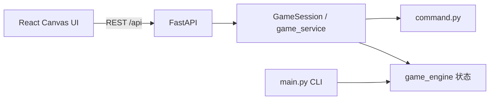

# 迭代 5：Web 图形界面与 DevOps 部署

## 1. 交付清单

| 要求 | 实现 | 路径 |
|------|------|------|
| Web UI（2D 图形） | React + Canvas 房间地图 | `frontend/` |
| 前后端分离 REST | FastAPI，对齐 `api-contract.yaml` | `backend/app.py` |
| 业务逻辑复用 | `game_service.py` + `world_builder.py` | `src/` |
| Docker 容器化 | 后端镜像 | `Dockerfile` |
| CI 镜像构建 | push 到 GHCR | `.github/workflows/ci.yml` |
| API 集成测试 | pytest + TestClient | `tests/test_api_integration.py` |

## 2. 架构



## 3. 本地运行

### 后端 API

```powershell
cd Soft-Engineering
python -m venv .venv
.\.venv\Scripts\Activate.ps1
pip install -r requirements.txt
uvicorn backend.app:app --reload --port 8000
```

### 前端 Web

```powershell
cd frontend
npm install
npm run dev
```

浏览器打开 http://localhost:5173 ，Vite 将 `/api` 代理到 `http://127.0.0.1:8000`。

### Docker 一键启动 API

```powershell
docker compose up --build api
```

## 4. API 会话说明

1. `POST /game/start` 返回 `sessionId`
2. 后续请求 Header：`X-Session-Id: <sessionId>`

主要端点：`/player`、`/player/status`、`/room`、`/movement`、`/combat/attack`、`/inventory`、`/item/pickup`、`/help`

## 5. CI 流水线

1. 单元测试（排除集成测试文件单独跑）
2. REST API 集成测试
3. Docker build & push `ghcr.io/<owner>/soft-engineering/mud-api:latest`（路径自动转小写，push 到 main/develop 时）
4. 前端 `npm run build` 校验

## 6. 验收自测命令

```powershell
pytest tests/test_api_integration.py -v
docker build -t mud-api:local .
docker run --rm -p 8000:8000 mud-api:local
```

## 7. 截图建议（提交报告）

- 浏览器 2D 界面运行截图
- `pytest tests/test_api_integration.py` 通过截图
- GitHub Actions 流水线绿勾 + GHCR 镜像截图
