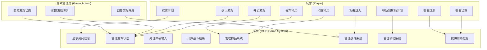
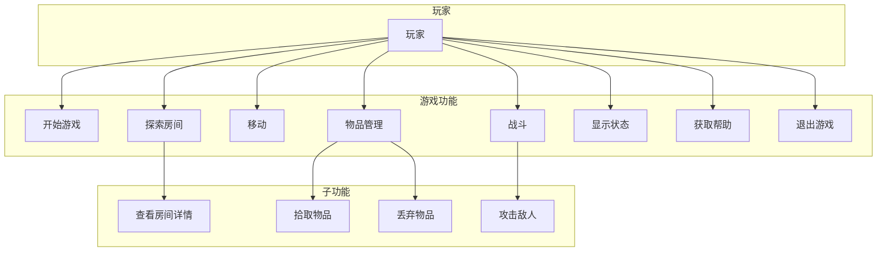
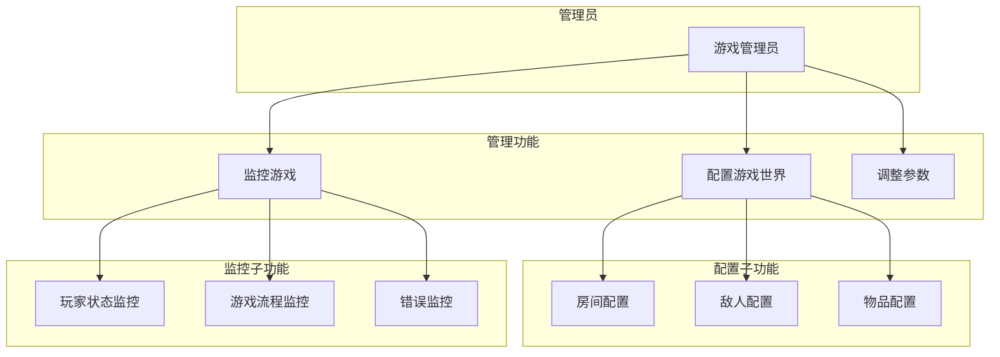
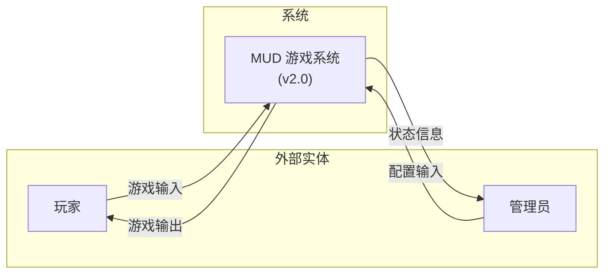
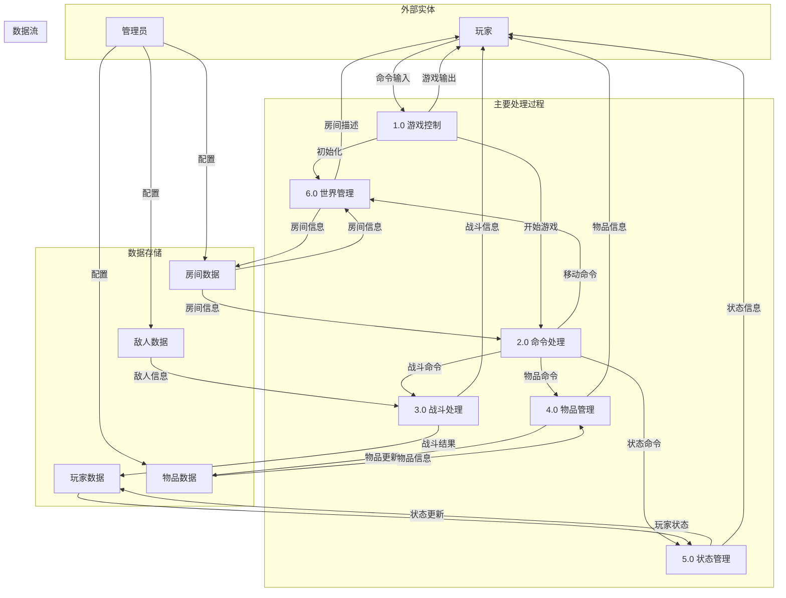
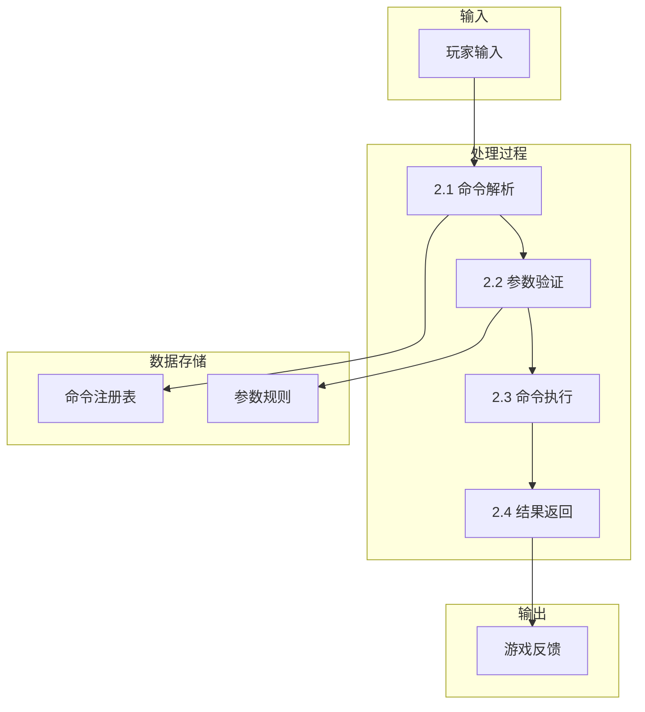
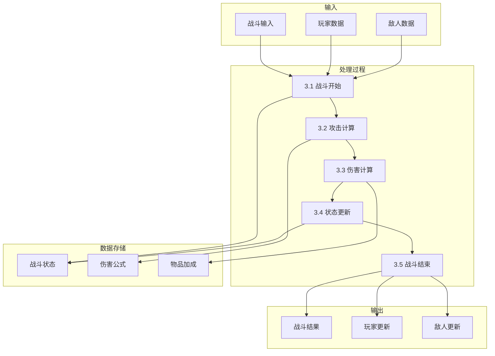

# 需求规格说明书（SRS）

**版本：** v2.0  
**更新日期：** 2026-04-09  
**文档状态：** Sprint 2 需求完善版本  
**团队：** 4399（符鹏、张琪）

## 1. 文档概述

本文档详细描述了 MUD（Multi-User Dungeon）文字游戏系统的需求规格。本版本整合了 Sprint 2 阶段利用大语言模型生成的核心业务用例图与 DFD 数据流图，完善了系统的功能性和非功能性需求描述。系统采用分层架构设计，提供文字冒险游戏体验。

## 2. 系统概述

### 2.1 系统目标
- 提供沉浸式的文字冒险游戏体验
- 支持玩家探索、战斗、物品管理等核心功能
- 具备良好的扩展性和可维护性
- 支持多种输入输出方式

### 2.2 系统范围
- **包含功能**：移动、探索、战斗、物品管理、状态查看、帮助系统
- **不包含功能**：图形界面、多人在线、网络通信、AI 对话

### 2.3 用户特征

| 用户类型 | 特征 | 需求 |
|----------|------|------|
| **普通玩家** | 喜欢文字冒险游戏，追求游戏体验 | 简单直观的操作，清晰的游戏反馈 |
| **高级玩家** | 熟悉 MUD 游戏，追求挑战性 | 复杂的战斗系统，策略性玩法 |
| **开发者** | 需要扩展系统功能 | 清晰的架构设计，易于扩展的代码结构 |

## 3. 业务用例图

### 3.1 系统级用例图



### 3.2 玩家用例图



### 3.3 游戏管理用例图



## 4. 数据流图（DFD）

### 4.0 上下文图（Level 0 DFD）



### 4.1 Level 1 DFD - 游戏系统流程



### 4.2 Level 2 DFD - 命令处理流程



### 4.3 Level 2 DFD - 战斗处理流程



## 5. 功能需求

### 5.1 核心游戏功能

#### 5.1.1 移动系统
**需求ID：** FR-MOV-001  
**优先级：** 高  

**功能描述：**  
玩家可以在房间之间移动，探索游戏世界。

**输入：**  
- 移动方向（north, south, east, west）

**处理逻辑：**  
1. 验证指定方向是否存在出口
2. 检查是否有敌人阻挡
3. 更新玩家当前位置
4. 触发房间进入事件

**输出：**  
- 移动成功/失败信息
- 新房间描述
- 房间内的物品和敌人信息

**接口示例：**
```
> move north
你向北移动，来到了北边的房间。
这是一个宽敞的大厅，四周有多个出口。
这里有：古书
```

#### 5.1.2 探索系统
**需求ID：** EXP-001  
**优先级：** 高  

**功能描述：**  
玩家可以查看当前房间的详细信息。

**输入：**  
- look 命令

**处理逻辑：**  
1. 获取当前房间对象
2. 生成房间描述
3. 显示房间内的物品
4. 显示房间内的敌人

**输出：**  
- 房间名称
- 房间描述
- 房间内物品列表
- 房间内敌人信息

**接口示例：**
```
> look
起始房间
这是一个温馨的小房间，四周墙壁上挂着几幅古老的画像。
这里有：火把
```

#### 5.1.3 战斗系统
**需求ID：** COM-001  
**优先级：** 高  

**功能描述：**  
玩家可以攻击房间内的敌人，进行战斗。

**输入：**  
- attack 命令

**处理逻辑：**  
1. 检查房间是否有敌人
2. 计算玩家攻击伤害
3. 敌人承受伤害
4. 检查敌人是否死亡
5. 敌人反击（如果存活）
6. 更新双方状态
7. 处理战利品

**输出：**  
- 战斗过程描述
- 伤害数值
- 双方剩余生命值
- 战斗结果

**接口示例：**
```
> attack
你攻击哥布林，造成了 25 点伤害！
哥布林剩余 HP: 25/50
哥布林反击，造成了 12 点伤害！
你剩余 HP: 88/100
```

#### 5.1.4 物品系统
**需求ID：** ITM-001  
**优先级：** 中  

**功能描述：**  
玩家可以拾取和丢弃物品。

**子功能：**
- 拾取物品（get）
- 丢弃物品（drop）

**输入：**  
- get [物品名]
- drop [物品名]

**处理逻辑：**  
1. 检查物品是否存在
2. 检查是否可以拾取/丢弃
3. 更新物品所有者
4. 更新背包状态

**输出：**  
- 操作成功/失败信息
- 背包更新信息

**接口示例：**
```
> get 火把
你拾取了火把。
```

#### 5.1.5 状态系统
**需求ID：** STA-001  
**优先级：** 中  

**功能描述：**  
玩家可以查看自己的状态信息。

**输入：**  
- status 命令

**处理逻辑：**  
1. 获取玩家属性
2. 显示生命值
3. 显示背包物品
4. 显示当前位置

**输出：**  
- 玩家名称
- 生命值信息
- 背包物品列表
- 当前位置

**接口示例：**
```
> status
玩家：张琪
HP：88/100
背包：火把
当前位置：起始房间
```

#### 5.1.6 帮助系统
**需求ID：** HLP-001  
**优先级：** 低  

**功能描述：**  
为玩家提供帮助信息。

**输入：**  
- help 命令

**处理逻辑：**  
1. 遍历所有可用命令
2. 生成命令帮助信息
3. 格式化输出

**输出：**  
- 所有可用命令列表
- 命令描述

**接口示例：**
```
> help
=== 可用命令 ===
look: 查看当前房间的详细信息
move: 向指定方向移动（north/south/east/west）
attack: 攻击敌人
get: 拾取物品（get [物品名]）
drop: 丢弃物品（drop [物品名]）
status: 查看你的状态和背包
help: 显示所有可用命令
quit: 退出游戏
```

### 5.2 管理功能

#### 5.2.1 游戏世界配置
**需求ID：** CFG-001  
**优先级：** 中  

**功能描述：**  
管理员可以配置游戏世界的房间、敌人、物品等。

**配置项：**
- 房间连接关系
- 敌人属性和掉落
- 物品属性和分布

#### 5.2.2 游戏状态监控
**需求ID：** MON-001  
**优先级：** 低  

**功能描述：**  
监控游戏运行状态和玩家行为。

**监控内容：**
- 玩家位置变化
- 战斗统计数据
- 物品流动情况

## 6. 非功能需求

### 6.1 性能需求

| 需求项 | 指标 | 描述 |
|--------|------|------|
| **响应时间** | < 100ms | 命令处理响应时间 |
| **并发用户** | 1 | 单用户游戏 |
| **内存占用** | < 50MB | 游戏运行内存使用 |
| **启动时间** | < 2s | 游戏启动时间 |

### 6.2 可靠性需求

| 需求项 | 指标 | 描述 |
|--------|------|------|
| **错误处理** | 完整 | 所有异常都有处理 |
| **数据一致性** | 100% | 游戏状态保持一致 |
| **崩溃恢复** | 自动 | 异常后安全退出 |

### 6.3 可用性需求

| 需求项 | 指标 | 描述 |
|--------|------|------|
| **易用性** | 简单 | 直观的命令系统 |
| **学习曲线** | < 5min | 新手快速上手 |
| **帮助文档** | 完整 | 内置帮助系统 |

### 6.4 可维护性需求

| 需求项 | 指标 | 描述 |
|--------|------|------|
| **代码复杂度** | < 10 | 圈复杂度阈值 |
| **模块化** | 高 | 低耦合高内聚 |
| **测试覆盖** | > 80% | 单元测试覆盖率 |

### 6.5 可扩展性需求

| 需求项 | 指标 | 描述 |
|--------|------|------|
| **新命令** | < 1h | 添加新命令时间 |
| **新功能** | < 1d | 添加新功能时间 |
| **配置扩展** | 支持 | 支持外部配置 |

## 7. 约束条件

### 7.1 技术约束
- 编程语言：Python 3.8+
- 架构模式：分层架构、MVC
- 设计模式：命令模式、策略模式等

### 7.2 环境约束
- 运行平台：Windows/Linux/macOS
- 依赖要求：标准库即可运行
- 存储要求：配置文件本地存储

### 7.3 业务约束
- 游戏类型：文字冒险游戏
- 单人游戏
- 离线模式

## 8. 假设与依赖

### 8.1 系统假设
- 玩家熟悉基本的文本交互
- 系统资源充足
- 网络连接不是必需的

### 8.2 外部依赖
- 无外部依赖（仅使用标准库）
- 无数据库依赖
- 无网络依赖

## 9. 验收标准

### 9.1 功能验收

| 功能 | 验收标准 | 测试用例 |
|------|----------|----------|
| 移动功能 | 可以在房间间正常移动 | 1. 移动到存在的房间<br>2. 尝试移动到不存在的出口 |
| 战斗功能 | 可以正常进行战斗 | 1. 攻击敌人<br>2. 被敌人攻击<br>3. 击败敌人<br>4. 被击败 |
| 物品功能 | 可以拾取和丢弃物品 | 1. 拾取房间物品<br>2. 丢弃背包物品<br>3. 尝试拾取不存在物品 |
| 状态查看 | 可以正确显示状态 | 1. 查看生命值<br>2. 查看背包<br>3. 查看位置 |

### 9.2 性能验收

| 项目 | 验收标准 | 测试方法 |
|------|----------|----------|
| 响应时间 | < 100ms | 命令执行时间测试 |
| 内存使用 | < 50MB | 内存监控 |
| 启动时间 | < 2s | 启动时间测量 |

### 9.3 质量验收

| 项目 | 验收标准 | 测试方法 |
|------|----------|----------|
| 错误处理 | 所有异常处理 | 异常注入测试 |
| 代码质量 | 圈复杂度 < 10 | 代码静态分析 |
| 测试覆盖 | > 80% | 单元测试覆盖率 |

## 10. 需求优先级

### 10.1 需求优先级矩阵

| 需求ID | 功能优先级 | 业务价值 | 实现难度 | 优先级排序 |
|--------|------------|----------|----------|------------|
| FR-MOV-001 | 高 | 核心 | 低 | P0 |
| EXP-001 | 高 | 核心 | 低 | P0 |
| COM-001 | 高 | 核心 | 中 | P0 |
| ITM-001 | 中 | 重要 | 低 | P1 |
| STA-001 | 中 | 重要 | 低 | P1 |
| HLP-001 | 低 | 辅助 | 低 | P2 |
| CFG-001 | 中 | 管理 | 中 | P1 |
| MON-001 | 低 | 监控 | 高 | P3 |

### 10.2 优先级说明
- **P0（必须实现）**：核心游戏功能，支撑基本玩法
- **P1（应该实现）**：重要功能，提升游戏体验
- **P2（可以延迟）**：辅助功能，不影响核心玩法
- **P3（可选实现）**：高级功能，提升管理能力

---

## 11. 附录

### 11.1 术语表

| 术语 | 定义 |
|------|------|
| MUD | Multi-User Dungeon，多用户地下城游戏 |
| DFD | Data Flow Diagram，数据流图 |
| UML | Unified Modeling Language，统一建模语言 |
| Command Pattern | 命令模式，一种设计模式 |
| Game Context | 游戏上下文，游戏状态管理对象 |

### 11.2 参考资料

1. 《软件工程：实践者的研究方法》
2. 《设计模式：可复用面向对象软件的基础》
3. 《UML 用户指南》

### 11.3 版本历史

| 版本 | 日期 | 作者 | 更新内容 |
|------|------|------|----------|
| v1.0 | 2026-03-12 | 张琪 | 初始版本 |
| v1.1 | 2026-03-19 | 符鹏 | 添加业务用例图 |
| v2.0 | 2026-04-09 | 符鹏、张琪 | 整合 DFD 图，完善需求规格 |

**文档维护：** 符鹏（产品需求）、张琪（技术实现）  
**文档审核：** 4399 团队