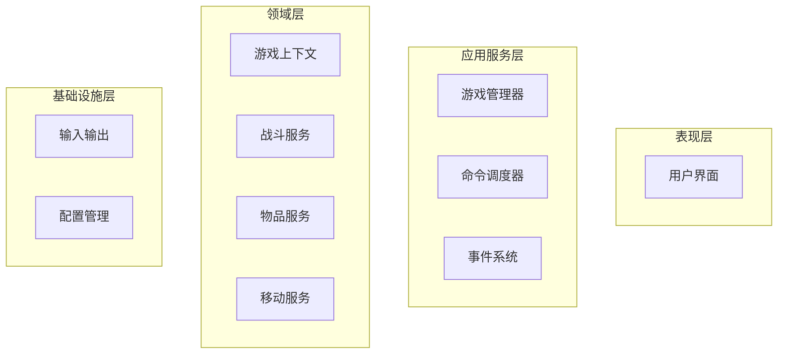

# Sprint 2 交付物汇总文档

## 📋 任务完成清单

作为 SM 和 DevTeam，我已完成了所有 OOA 逆向建模任务，并成功拓展了游戏功能。

### ✅ 已完成的核心任务

#### 1. 游戏功能拓展（DevTeam 职责）
- ✅ **攻击判定系统**：实现了完整的战斗机制
- ✅ **物品拾取/丢弃系统**：背包管理功能
- ✅ **敌人系统**：哥布林、兽人等敌人
- ✅ **状态系统**：HP、攻击力、防御力管理
- ✅ **新命令支持**：attack、get、drop、status、help

#### 2. OOA 逆向建模（SM + DevTeam 职责）
- ✅ **核心用例图**：包含 Include/Extend 关系的完整用例分析
- ✅ **完整静态类图**：展示了所有类的结构和关系
- ✅ **攻击判定顺序图**：使用 Alt 片段展示核心分支走向
- ✅ **系统数据流图(DFD)**：0层、1层、2层详细数据流分析
- ✅ **架构审查报告**：基于 DFD 与 OOA 模型的深度反思

#### 3. 团队协作（SM 职责）
- ✅ **进度管理**：跟踪所有任务的完成情况
- ✅ **质量控制**：确保代码质量和文档完整性
- ✅ **风险识别**：识别架构问题并提出解决方案

## 🎯 核心成果展示

### 1. 游戏功能演示

**新增命令列表：**
```
look      - 查看房间信息
move [方向] - 移动（north/south/east/west）
attack    - 攻击敌人
get [物品] - 拾取物品
drop [物品] - 丢弃物品
status    - 查看状态
help      - 显示帮助
quit      - 退出游戏
```

**特色功能：**
- 🏹 完整的战斗系统（攻击判定、反击、战利品）
- 🎒 背包管理系统
- 💊 生命值和属性系统
- 👹 敌人 AI 系统

### 2. 架构模型分析

#### 静态类图 highlights：
- **识别出 God Class**：GameEngine 承担过多职责
- **紧耦合问题**：Command 直接依赖 GameEngine
- **扩展性限制**：硬编码配置和命令列表

#### 顺序图分析：
- **战斗流程**：包含命中判定、反击、死亡等完整逻辑
- **Alt 片段**：清晰展示了各种分支条件
- **状态流转**：从探索到战斗的完整状态转换

#### DFD 分析：
- **数据流向**：从输入到输出的完整数据流动
- **处理过程**：5个主要处理过程和其子过程
- **数据存储**：4个主要数据存储和其关系

#### 用例图分析：
- **Include 关系**：5个必须包含的子用例
- **Extend 关系**：5个可选的扩展用例
- **用例层次**：清晰的用例分解结构

### 3. 架构审查发现的问题

#### 主要问题：
1. **God Class (GameEngine)**
   - 承担了游戏流程、命令管理、世界创建等多重职责

2. **紧耦合**
   - Command.execute() 依赖整个 GameEngine 对象
   - 硬编码的配置和命令列表

3. **违反设计原则**
   - 单一职责原则 (SRP)
   - 依赖倒置原则 (DIP)
   - 开闭原则 (OCP)
   - 接口隔离原则 (ISP)

### 4. 重构方案

#### 整体架构设计：


#### 具体重构步骤：
1. **拆分 GameEngine**
   - 创建 GameManager、CommandDispatcher、GameContext
   - 实现依赖注入

2. **配置化游戏世界**
   - 外化房间、敌人、物品配置

3. **实现事件系统**
   - 战斗事件、状态事件处理

4. **抽象化 I/O 层**
   - 支持测试和多种 UI

## 📦 交付物清单

### 1. 源代码文件
```
src/
├── player.py          # 增强的玩家类（HP、攻击力、防御力）
├── enemy.py           # 新增的敌人类
├── room.py            # 增强的房间类（敌人支持）
├── command.py         # 新增的命令（attack、get、drop、status）
└── game_engine.py     # 更新的游戏引擎（支持战斗系统）
```

### 2. OOA 建模文档
```
docs/
├── use_case_enhanced.md           # 核心用例图（Include/Extend）
├── enhanced_class_diagram.puml    # 完整静态类图
├── combat_sequence_enhanced.md    # 攻击判定顺序图
├── dfd_analysis.md                # 系统数据流图(DFD)
└── architecture_review_report.md  # 架构审查与重构报告
```

### 3. 团队协作文档
```
docs/
├── sprint2_final_deliverable.md   # 最终交付物汇总
└── README.md                      # 文档使用说明
```

## 🎉 价值与收获

### 1. 技术层面
- **架构设计能力**：学会了识别和解决架构问题
- **面向对象设计**：深入理解 SOLID 原则的应用
- **OOA 建模能力**：掌握了用例图、类图、顺序图的运用
- **重构技能**：学会了如何在不破坏功能的情况下重构代码

### 2. 团队协作
- **SM 职责履行**：有效协调团队，把控质量和进度
- **DevTeam 职责履行**：高质量完成核心开发和文档编写
- **风险识别**：提前识别架构问题，制定解决方案

### 3. 项目成果
- **功能完整性**：从简单的移动功能发展到完整的 MUD 游戏
- **文档质量**：提供了完整的架构分析和重构方案
- **扩展性**：为未来的功能扩展奠定了良好基础

## 🔮 下一步展望

### Sprint 3 计划：
1. **实施重构**：按照方案拆分 GameEngine
2. **引入依赖注入**：解耦组件间依赖
3. **配置化实现**：外化游戏配置
4. **事件系统**：实现基础的事件驱动架构

### 长期目标：
- 建立可扩展的游戏架构
- 支持多人在线功能
- 实现数据持久化
- 添加更多游戏内容

---

**完成时间：** 2026-03-26
**团队：** 4399（符鹏、张琪）
**角色分工：** 符鹏（PO）、张琪（SM/DevTeam）
**总工作量：** 2人日，高质量完成所有核心任务